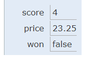

.. qnum::
   :prefix: 1-3-
   :start: 1
   

.. |CodingEx| image:: ../../_static/codingExercise.png
    :width: 30px
    :align: middle
    :alt: coding exercise
    
    
.. |Exercise| image:: ../../_static/exercise.png
    :width: 35
    :align: middle
    :alt: exercise
    
    
.. |Groupwork| image:: ../../_static/groupwork.png
    :width: 35
    :align: middle
    :alt: groupwork

.. |visualizer| raw:: html

   <a href="https://cscircles.cemc.uwaterloo.ca/java_visualize/">Java Visualizer</a> 

.. |cup| raw:: html

       

Variables and Data Types
========================

In this lesson, you will learn about variables and primitive data types.

What is a Variable?
-------------------

..	index::
	single: variable

A **variable** is a name associated with a memory location in the computer.  
Computer memory can store a value and that value can change or vary.  

The following `video <https://youtu.be/pHgYlVjagmA>`_ explains what a variable is and gives a couple of real word examples of variables.

.. youtube:: pHgYlVjagmA
    :width: 600
    :align: center

Data Types
----------

..	index::
	single: integer
	single: int
	single: double
	single: boolean
	single: String
	pair: variable; types
	pair: variable; primitive type
	pair: variable; object type
	pair: variable; integer
	pair: variable; floating point
	pair: variable; Boolean
	pair: variable; String

There are two types of variables in Java: **primitive variables** 
that hold primitive types and **object variables** that hold a reference 
to an object of a class.  A reference is a way to find the object 
(like a UPS tracking number helps you find your package).  
The primitive types presented in this chapter are: 

-  **int** - which store integers (numbers like 3, -76, 20393) 

-  **double** - which store floating point numbers (decimal numbers like 6.3 -0.9, and 60293.93032)
    
-  **boolean** - which store Boolean values (either true or false). 

**String** is an object type and is the name of a class in Java.  
A string object has a sequence of characters enclosed in a pair of double quotes - like "Hello".  
You will learn more about ``String`` and other object types in Unit 2. 

.. note:: 

   Some languages use 0 to represent false and 1 to represent true, but Java uses the keywords ``true`` and ``false`` in boolean variables.  

A type is a set of values (a domain) and a set of operations on them. 
For example, you can do mathematical addition with ints and doubles but not with booleans and Strings.

|Exercise| **Check your understanding**
   
   
.. mchoice:: q1_3_1
   :practice: T
   :answer_a: int
   :answer_b: double
   :answer_c: boolean
   :answer_d: String
   :correct: b
   :feedback_a: While you could use an int, this would throw away any digits after the decimal point, so it isn't the best choice.  You might want to round up a grade based on the average (89.5 or above is an A). 
   :feedback_b: An average is calculated by summing all the values and dividing by the number of values.  To keep the most amount of information this should be done with decimal numbers so use a double. 
   :feedback_c: Is an average true or false?
   :feedback_d: While you can use a string to represent a number, using a number type (int or double) is better for doing calculations.

   What type should you use to represent the average grade for a course?
   
.. mchoice:: q1_3_2
   :practice: T
   :answer_a: int
   :answer_b: double
   :answer_c: boolean
   :answer_d: String
   :correct: a
   :feedback_a: The number of people is a whole number so using an integer make sense.  
   :feedback_b: Can you have 2.5 people in a household?
   :feedback_c: Is the number of people something that is either true or false?
   :feedback_d: While you can use a string, a number is better for doing calculations with (like finding the average number of people in a household).

   What type should you use to represent the number of people in a household?
   
.. mchoice:: q1_3_3
   :practice: T
   :answer_a: int
   :answer_b: double
   :answer_c: boolean
   :answer_d: String
   :correct: d
   :feedback_a: People don't usually have whole numbers like 7 as their first name. 
   :feedback_b: People don't usually have decimal numbers like 3.5 as their first name.
   :feedback_c: This could only be used if the name was true or false.  People don't usually have those as first names.
   :feedback_d: Strings hold sequences of characters like you have in a person's name.

   What type should you use to hold the first name of a person?
   
.. mchoice:: q1_3_4
   :practice: T
   :answer_a: int
   :answer_b: double
   :answer_c: boolean
   :answer_d: String
   :correct: c
   :feedback_a: While you could use an int and use 0 for false and 1 for true this would waste 31 of the 32 bits an int uses. Java has a special type for things that are either true or false.
   :feedback_b: Java has a special type for variables that are either true or false.
   :feedback_c: Java uses boolean for values that are only true or false.
   :feedback_d: While you can use a string to represent "True" or "False", using a boolean variable would be better for making decisions.  

   What type should you use to record if it is raining or not?
   
.. mchoice:: q1_3_5
   :practice: T
   :answer_a: int
   :answer_b: double
   :answer_c: boolean
   :answer_d: String
   :correct: b
   :feedback_a: The integer type (int) can't be used to represent decimal numbers so you couldn't use it if you had any cents.
   :feedback_b: The double type can be used to represent an amount of money.
   :feedback_c: Java uses boolean for values that are only true or false.
   :feedback_d: While you can use a string to represent the amount of money you have it is easier to do calculations on the numeric types (int or double).

   What type should you use to represent the amount of money you have?
   

.. fillintheblank:: q1_3_6

   What type should you use for a shoe size like 8.5?  

   -    :^\s*double$: Correct.  Any variable that needs to values after the decimal point should be declared as a double.
        :.*: What type allows for a decimal value  
            
.. fillintheblank:: q1_3_7

   What type should you use for the number of tickets purchased? 

   -    :^\s*int$: Correct. You can't buy half a ticket so this will be an integer.
        :.*: Use a type that represents whole numbers like 1, 2, 3, etc.
 

Declaring Variables in Java
---------------------------

..	index::
	single: bit
	single: binary digit
	single: declare
	pair: variable; declare
  
A variable allows you to store a value in a named memory location.
To create a variable, you must tell Java its data type and its name.  
Creating a variable is also called **declaring a variable**.  
The type is a keyword like int, double, or boolean, but you get to make up the 
name for the variable.  When you create a **primitive variable** Java will set aside 
enough bits in memory for that primitive type and associate that memory location 
with the variable name that you used.   

To **declare** (create) a variable, you  specify the type, leave at least one space, 
then the name for the variable and end the line with a semicolon (``;``). 
Java uses the keyword **int** for integer, **double** for a floating point 
number (a double precision number), and **boolean** for a Boolean value (true or false). 

Here is an example **declaration** of a variable called *score*  that has type *int*.

.. code-block:: java

  int score;
  
After declaring a variable, you can give it a value like below using an equals sign ``=`` followed 
by the value.  The first time a variable is assigned a value is referred to as **variable initialization**.

.. code-block:: java

  int score;
  score = 4;
  
Or you can set an initial value for the variable in the variable declaration. 
Here is an example that shows **declaring** a variable and **initializing** it all in a single statement.  

.. code-block:: java

  int score = 4;  

The equal sign here ``=`` doesn't mean the same as it does in a mathematical equation 
where it implies that the two sides are equal.  
Here it means set the value in the memory 
location associated with the variable name on the left to a *copy* of the 
value on the right. 
The line above sets the value in 
the memory location called score to 4.

    
    Figure 1: Storing variables in memory

.. note::
    
    The equal sign ``=`` operator performs variable assignment.  ``score=4`` results in the value 4 being copied into the memory location for variable score.
    

|CodingEx| **Coding Exercise:** 
 
.. activecode:: code1_3_1
   :language: java
   :autograde: unittest      
   
   Run the following code to see what is printed. 
   Then, change the values and run it again. 

   Click the ``Show CodeLens`` button and then use the ``Next`` button to step through the 
   program one line at a time.  Stepping through a program lets you see how memory is assigned for each variable.

   ~~~~
   public class VariableAssignment
   {
      public static void main(String[] args)
      {
        int score; 
        score = 4;
        System.out.println(score);
        
        double price = 23.25;
        System.out.println(price);
        
        boolean won = false;
        System.out.println(won);
        won = true;
        System.out.println(won);
        
        String name = "Jose";
        System.out.println(name);
      }
   }
        
   ====
   // should pass if/when they run code
   import static org.junit.Assert.*;
   import org.junit.*;;
   import java.io.*;

   public class RunestoneTests extends CodeTestHelper
   {
        @Test
        public void testMain() throws IOException
        {
            String output = getMethodOutput("main");
            String expect = "4\n23.25\nfalse\ntrue\nJose";
            boolean passed = getResults(expect, output, "Expected output from main", true);
            assertTrue(passed);
        }
   }

When you are printing the value of a variable, never put quotes "" around the variable 
because that will print out the variable 
name letter by letter. For example, ``System.out.println("score");`` will print out the string "score",
rather than the value "0" stored in the variable.  Normally you do not want to print out the variable name, 
but the value of the variable in memory. If you're not sure what this means, try 
putting quotes around the variables in the print statements above and see what happens.   
   
.. note::
    
    Avoid putting a variable inside quotes ("") in a print statement since that 
    would print the variable name instead of its value.
 
    
|Exercise| **Check Your Understanding**
   
.. clickablearea:: q1_3_8
    :question: Click on all of the variable declarations in the following code.
    :iscode:
    :feedback: Variable declarations start with a type and then a name.  
    
    :click-incorrect:public class Test2:endclick:
    :click-incorrect:{:endclick:
        :click-incorrect:public static void main(String[] args):endclick:
        :click-incorrect:{:endclick:
            :click-correct:int numLives;:endclick:
            :click-incorrect:numLives = 0;:endclick:
            :click-incorrect:System.out.println(numLives);:endclick:
            :click-correct:double health;:endclick:
            :click-incorrect:health = 8.5;:endclick:
            :click-incorrect:System.out.println(health);:endclick:
            :click-correct:boolean powerUp;:endclick:
            :click-incorrect:powerUp = true;:endclick:
            :click-incorrect:System.out.println(powerUp);:endclick:
        :click-incorrect:}:endclick:
    :click-incorrect:}:endclick:
    
.. clickablearea:: q1_3_9
    :question: Click on all of the variable initializations (first time the variable is set to a value) in the following code.
    :iscode:
    :feedback: Variables are initialized using name = value;  
    
    :click-incorrect:public class Test2:endclick:
    :click-incorrect:{:endclick:
        :click-incorrect:public static void main(String[] args):endclick:
        :click-incorrect:{:endclick:
            :click-incorrect:int numLives;:endclick:
            :click-correct:numLives = 0;:endclick:
            :click-incorrect:System.out.println(numLives);:endclick:
            :click-correct:double health = 8.5;:endclick:
            :click-incorrect:System.out.println(health);:endclick:
            :click-correct:boolean powerUp = true;:endclick:
            :click-incorrect:System.out.println(powerUp);:endclick:
        :click-incorrect:}:endclick:
    :click-incorrect:}:endclick:

.. clickablearea:: q1_3_10
    :question: Click on all of the statements that both declare and initialize a variable in one statement.
    :iscode:
    :feedback: Variables are initialized using name = value;  
    
    :click-incorrect:public class Test2:endclick:
    :click-incorrect:{:endclick:
        :click-incorrect:public static void main(String[] args):endclick:
        :click-incorrect:{:endclick:
            :click-incorrect:int numLives;:endclick:
            :click-incorrect:numLives = 0;:endclick:
            :click-incorrect:System.out.println(numLives);:endclick:
            :click-correct:double health = 8.5;:endclick:
            :click-incorrect:System.out.println(health);:endclick:
            :click-correct:boolean powerUp = true;:endclick:
            :click-incorrect:System.out.println(powerUp);:endclick:
        :click-incorrect:}:endclick:
    :click-incorrect:}:endclick:

**Mixed up Code Problems**
   
.. parsonsprob:: q1_3_11
   :numbered: left
   :adaptive:
   :noindent:

   The following code declares and initializes variables for storing a number of 
   visits, a person's temperature, and if the person has insurance or not.  
   It also includes extra blocks that are not needed in a correct solution.  
   Drag the needed blocks from the left area into the correct order 
   (declaring numVisits, temp, and hasInsurance in that order) in the right area.  
   Check your solution.
   -----
   int numVisits = 5;
   =====
   Int numVisits = 5; #paired
   =====
   double temp = 101.2;
   =====
   Double temp = 101.2;  #paired
   =====
   boolean hasInsurance = false;
   =====
   Boolean hasInsurance = false; #paired
 
   
|Exercise| **Check Your Understanding**

.. fillintheblank:: q1_3_12

   Fill in the following: [blank] age = [blank]; to declare age to be an integer and set its value to 5.

   -    :int: Correct.  You typically use whole numbers for ages after age 1.  
        :.*: Remember that Java uses just the first 3 letters of integer
   -    :5: Correct.  You can initialize to a value.  
        :.*: Use 5 in the second blank 

.. fillintheblank:: q1_3_13

   Fill in the following: Declare a double variable named gpa.

   -    :double gpa;: Correct.    
        :.*: double gpa;

.. fillintheblank:: q1_3_14

   Fill in the following: Declare in int named studentCount and initialize it to 46.

   -    :int studentCount = 46;: Correct.    
        :.*: int studentCount = 46;

.. fillintheblank:: q1_3_15

   Fill in the following: Declare in boolean variable isRaining and initialize it to true.

   -    :boolean isRaining = true;: Correct.    
        :.*: boolean isRaining = true;

Types in Memory
---------------------------

Computers store all values using **bits** (binary digits).  A **bit** can represent two values 
and we usually say that the value of a bit is either 0 or 1. When you declare a variable, 
you have to tell Java the type of the variable because Java needs to know how many 
bits to use and how to represent the value.  The 3 different primitive types
all require different number of bits.  An integer gets 32 bits of space, a double 
gets 64 bits of space and a boolean could be represented by just one bit. 

.. figure:: Figures/typesAndSpace.png
    :width: 500px
    :figclass: align-center
    
    Figure 2: Examples of variables with names and values.  Notice that the different types get a different amount of space.

String Concatenation
---------------------------

You often need to print a message that mixes text with a variable value.  You can use the **string concatenation** operator ``+`` to 
combine strings.  So ``"hi " + "there"`` will create a new String object with the
value ``"hi there"``.  If the variable **name** has a value "Jose", 
then the code ``"Hi " + name`` will create a new String object with value ``"Hi Jose"``.

|CodingEx| **Coding Exercise:** 
 
 
.. activecode:: code1_3_2
   :language: java
   :autograde: unittest      
   
   Run the following code to see what is printed. 
   ~~~~
   public class StringConcatenation
   {
      public static void main(String[] args)
      {
        int score; 
        score = 0;
        System.out.println("The score is " + score);
        
        double price = 23.25;
        System.out.println("The price is " + price);
        
        boolean won = false;
        System.out.println("Won? " + won);
        won = true;
        System.out.println("Won? " + won);
        
        String name = "Jose";
        System.out.println("Hi " + name);
      }
   }
        
   ====
   // should pass if/when they run code
   import static org.junit.Assert.*;
   import org.junit.*;;
   import java.io.*;

   public class RunestoneTests extends CodeTestHelper
   {
        @Test
        public void testMain() throws IOException
        {
            String output = getMethodOutput("main");
            String expect = "The score is 0\nThe price is 23.25\nWon? false\nWon? true\nHi Jose";
            boolean passed = getResults(expect, output, "Expected output from main", true);
            assertTrue(passed);
        }
   }
   
If you want spaces between words and variables when printing, you must put the 
space within the quoted string.  For example, notice the space in the string "Hi " in the last print statement. If you forget to add spaces, you will get smushed output 
like "HiJose" instead of "Hi Jose".  

Also note that the variable has to be on the 
left side of the ``=`` and the value on the right.  Switching the two is 
called **assignment dyslexia**.  
   
|CodingEx| **Coding Exercise:** 

.. activecode:: code1_3_3
   :language: java
   :autograde: unittest   
   
   This is an example of *assignment dyslexia*, when the coder has put the value on the left and the declaration on the right side.  Try to fix the following code to compile and run.
   ~~~~
   public class Dyslexia
   {
      public static void main(String[] args)
      {
        int score;
        4 = score; 
        System.out.println(score);
      }
   }
        
   ====
   // should pass if/when they run code
   import static org.junit.Assert.*;
   import org.junit.*;;
   import java.io.*;

   public class RunestoneTests extends CodeTestHelper
   {
        @Test
        public void testMain() throws IOException
        {
            String output = getMethodOutput("main");
            String expect = "4";
            boolean passed = getResults(expect, output, "Expected output from main");
            assertTrue(passed);
        }
   }
   
  

   
The keyword **final** can be used in front of a variable declaration to make it a constant that cannot be changed. Constants are traditionally capitalized.

.. code-block:: java

  final double PI = 3.14

|CodingEx| **Coding Exercise:** 

.. activecode:: code1_3_4
   :language: java
   :autograde: unittest 
   
   Try the following code and notice the syntax error when we try to change the constant PI. Put the comment symbols // in front of that line to remove the error and run it again.
   ~~~~
   public class FinalVariable
   {
      public static void main(String[] args)
      {
        final double PI = 3.14;
        System.out.println(PI);
        PI = 4.2; // This will cause a syntax error
      }
   }
   ====
   // should pass if/when they run code
   import static org.junit.Assert.*;
   import org.junit.*;;
   import java.io.*;

   public class RunestoneTests extends CodeTestHelper
   {
        @Test
        public void testMain() throws IOException
        {
            String output = getMethodOutput("main");
            String expect = "3.14";
            boolean passed = getResults(expect, output, "Expected output from main", true);
            assertTrue(passed);
        }
   }   

Naming Variables
--------------------

..	index::
	pair: variable; names

While you can name your variable almost anything, there are some rules.  A variable name should start with an alphabetic character (like a, b, c, etc.) and can include letters, numbers, and underscores ``_``. It must be all one word with no spaces. 

You can't use any of the keywords or reserved words as variable names in Java (``for``, ``if``, ``class``, ``static``, ``int``, ``double``, etc).  For a complete list of keywords and reserved words see http://docs.oracle.com/javase/tutorial/java/nutsandbolts/_keywords.html.  

The name of the variable should describe the data it holds.  
A name like ``score`` helps make your code easier to read. 
A name like ``x`` is not a good variable name in programming, 
because it gives no clues as to what kind of data it holds.  Do not name
your variables crazy things like ``thisIsAReallyLongName``. 
You want to make your code easy to understand, not harder.  

.. note::

    
    - Use meaningful variable names! 
    - Start variable names with a lower case letter and use camelCase. 
    - Variable names are case-sensitive and spelling sensitive! Each use of the variable in the code must match the variable name in the declaration exactly. 
    - Never put variables inside quotes (" ").

..	index::
    single: camel case
	pair: variable; naming convention
	
The convention in Java and many programming languages is to always start a variable name with a lower case letter and then uppercase the first letter of each additional word. Variable names can not include spaces so uppercasing the first letter of each additional word makes it easier to read the name.  Uppercasing the first letter of each additional word is called **camel case**. Another option is to use underscore ``_`` to separate words, but you cannot have spaces in a variable name. 

  
.. activecode:: code1_3_5
   :language: java
   :autograde: unittest   

   Java is case sensitive so ``playerScore`` and ``playerscore`` are not the same.  Run the code below to see the difference.
   ~~~~
   public class CaseSensitive
   {
      public static void main(String[] args)
      {
        int playerScore = 0; // variable name using camel case
        int playerscore = 1; // this is a different variable
        System.out.println("playerScore is " + playerScore);
        System.out.println("playerscore is " + playerscore);
      }
   }
   
   ====
   import static org.junit.Assert.*;
   import org.junit.*;;
   import java.io.*;

   public class RunestoneTests extends CodeTestHelper
    {
        @Test
        public void testMain() throws IOException
        {
            String output = getMethodOutput("main");
            String expect = "playerScore is 0\nplayerscore is 1";
            boolean passed = getResults(expect, output, "Expected output from main", true);
            assertTrue(passed);
        }
    }
   
|Exercise| **Check Your Understanding**
            
.. fillintheblank:: q1_3_16

   What is the camel case variable name for a variable that represents a shoe size?

   -    :^\s*shoeSize$: Correct.  Start with the first word in all lowercase and uppercase the first letter of each additional word
        :.*: In camel case just appended the words after each other but uppercase the first letter of each word after the 1st word

            
            
.. fillintheblank:: q1_3_17

   What is the camel case variable name for a variable that represents the top score?

   -    :^\s*topScore$: Correct.
        :.*: In camel case just put the words after each other but uppercase the first letter of each word after the 1st word. 
            
.. .. fillintheblank:: q1_3_18

   What is the camel case variable name for a variable that represents the last score?

   -    :^\s*lastScore$: Correct.
        :.*: In camel case just put the words after each other but uppercase the first letter of each word after the 1st word.  This would be lastScore

|Groupwork| Debugging Challenge : Weather Report
------------------------------------------------

.. activecode:: code1_3_6
   :language: java
   :autograde: unittest   
   :practice: T

   Debug the following code. Can you find the all the bugs and get the code to run? 
   ~~~~
   public class WeatherChannel
   {
      public static void main(String[] args)
      {
         int temperature = 70.5;
         double radioChannel = 101;
         boolean sunny = 1
         
         System.out.print("Welcome to the weather report on Channel ")
         System.out.println(Radiochannel);
         System.out.print("The temperature today is );
         System.out.println(tempurature);
         System.out.print("Is it sunny today? ");
         System.out.println(sunny);
      }
   }

   ====
   import static org.junit.Assert.*;
   import org.junit.*;
   import java.io.*;

   public class RunestoneTests extends CodeTestHelper
   {
      @Test
      public void testMain() throws IOException
      {
        String output = getMethodOutput("main");
        String expect = "Welcome to the weather report on Channel 101 \nThe temperature today is 70.5\nIs it sunny today? true";
        boolean passed = getResults(expect, output, "Expected output from main");
        assertTrue(passed);
      }
   }
            

Summary
-------------------

- A **variable** is a name for a memory location where you can store a value that can change or vary.

- A variable can be declared and initialized with the following code:

.. code-block:: java

  int score; 
  double gpa = 3.5;
  
  
- **Data types** can be categorized as either primitive type (like int) or reference type (like String).
- The three primitive data types used in this course are **int** (integer numbers), **double** (decimal numbers), and **boolean** (true or false).
- Each variable has associated memory that is used to hold its value.
- The memory associated with a variable of a primitive type holds an actual primitive value.
- When a variable is declared final, its value cannot be changed once it is initialized.  

.. raw:: html
    
    

