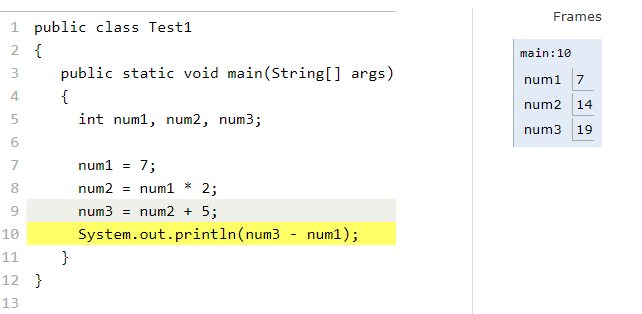
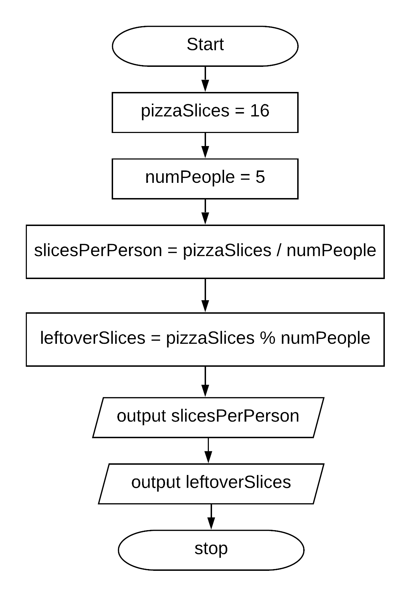
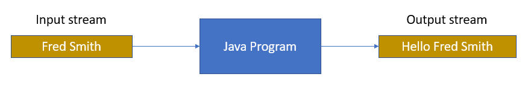
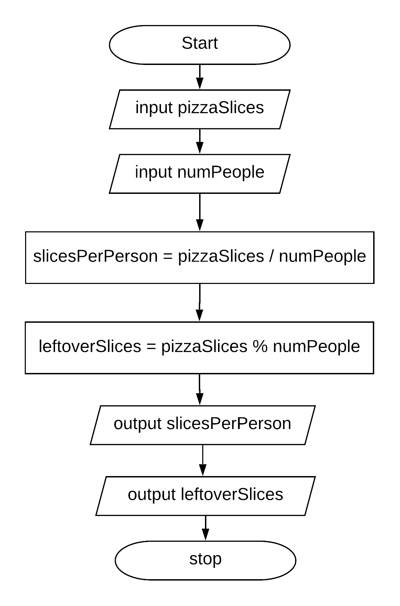

.. qnum::
   :prefix: 1-4-
   :start: 1

   
.. |CodingEx| image:: ../../_static/codingExercise.png
    :width: 30px
    :align: middle
    :alt: coding exercise
    
    
.. |Exercise| image:: ../../_static/exercise.png
    :width: 35
    :align: middle
    :alt: exercise
    
    
.. |Groupwork| image:: ../../_static/groupwork.png
    :width: 35
    :align: middle
    :alt: groupwork

.. |visualizer| raw:: html

   <a href="https://cscircles.cemc.uwaterloo.ca/java_visualize/">Java Visualizer</a>    
 
.. |cup| raw:: html

   <a href="https://cscircles.cemc.uwaterloo.ca/java_visualize/">Java Visualizer</a>    

    
Expressions and Assignment Statements
=====================================

In this lesson, you will learn about assignment statements and expressions 
that contain math operators and variables. 

Assignment Statements
---------------------

Remember that a variable holds a value that can change or 
vary.  **Assignment statements** initialize or change the value stored 
in a variable using the assignment operator ``=``.  An assignment statement always has a 
single variable on the left hand side of the = sign. The **value of the 
expression**  on the right hand side of 
the = sign (which can contain math operators and other variables) is copied 
into the memory location of the variable on the left hand side.

.. figure:: Figures/assignment.png
    :width: 300px
    :figclass: align-center
    :alt: Assignment statement
    
    Figure 1: Assignment Statement (variable = expression)

Instead of saying equals for the ``=`` operator in an assignment statement, 
say “gets” or “is assigned” to 
remember that the variable on the left hand side gets or is assigned the value on the right. 
In the figure above, score is assigned the value of 10 times points 
(which is another variable) plus 5.

The following video by Dr. Colleen Lewis shows how variables can change values in 
memory using assignment statements.

.. youtube:: MZwIgM__5C8
    :width: 700
    :align: center

As we saw in the video, 
we can set one variable to a copy of the value of another variable like y = x;. 
This won’t change the value of the variable that you are copying from.

|CodingEx| **Coding Exercise:** 

.. activecode:: code1_4_1
   :language: java
   :autograde: unittest   
   
   Click on the ``Show CodeLens`` button to step through the code and see how the values of the variables change. 
   ~~~~
 
    public class VariableAssignment
    {
      public static void main(String[] args)
      {
        int x = 3;
        int y = 2;
        System.out.println(x);
        System.out.println(y);
        x = y;
        System.out.println(x);
        System.out.println(y);
        y = 5;
        System.out.println(x);
        System.out.println(y);
      }
    }
    ====

   
|Exercise| **Check your understanding**
   

    

.. fillintheblank:: q1_4_1

   |codeq|
   The code above shows the variable state in memory after line 9 is executed. What is printed when line 10 is executed?

   -    :12: Correct.
        :.*: num3 - num1 = 19 - 7 = 12 
  

|CodingEx| **Coding Exercise:** 

.. activecode:: code1_4_2
   :language: java
   :autograde: unittest   
   
   The code below makes an attempt to swap the values stored in the two variables x and y (so x ends up with y's initial 
   value  of 5 and y ends up with x's initial value of 3).  Unfortunately this code has an error and does not work.
   Use the CodeLens to step through the code to understand why it fails to swap the values in x and y.  
   
   ~~~~
 
    public class ErrorSwap
    {
      public static void main(String[] args)
      {
        int x = 3;
        int y = 5;
        System.out.println(x);  //3
        System.out.println(y);  //5
        x = y;
        y = x;
        System.out.println(x);  //should be 5
        System.out.println(y);  //should be 3
      }
    }
    ====

.. shortanswer:: q1_4_2

   Explain in your own words why the ``ErrorSwap`` program code does not swap the values stored in x and y.

|Exercise| **Check your understanding**

Swapping two variables requires a third variable to store the value of x before assigning 
x to the value of y.  The variable y then gets assigned to the temporary variable value.
In the mixed up programs below, drag the blocks to the right to put them in the right order.

.. parsonsprob:: q1_4_3
   :numbered: left
   :practice: T
   :adaptive:
   :noindent:

   The following has the correct code that uses a third variable named "temp" to swap the 
   values in x and y. 

   The code is mixed up and contains <b>one extra block</b> which is not needed 
   in a correct solution.  Drag the needed blocks from the left into the correct 
   order on the right, then check your solution.  
   You will be told if any of the blocks are in the wrong order or if you need to remove 
   one or more blocks.  
   
   After three incorrect attempts you will be able to use the <i>Help Me</i> button to make the problem easier.  
   -----
   int x = 3;
   int y = 5;
   int temp = 0;
   =====
   temp = x;
   =====
   x = y;
   =====
   y = temp;
   =====
   y = x; #distractor

.. activecode:: code1_4_3
   :language: java
   :autograde: unittest   
   
   Fix the code below to perform a correct swap of x and y.  
   You need to add a new variable named ``temp`` to use for the swap.
   ~~~~
 
    public class CorrectSwap
    {
      public static void main(String[] args)
      {
        int x = 3;
        int y = 5;
        System.out.println(x);
        System.out.println(y);
        x = y;
        y = x;
        System.out.println(x);
        System.out.println(y);
      }
    }
    ====
    import static org.junit.Assert.*;
    import org.junit.After;
    import org.junit.Before;
    import org.junit.Test;

    import java.io.*;

    public class RunestoneTests extends CodeTestHelper
    {
        @Test
        public void test1()
        {
            String output = getMethodOutput("main");
            String expect = "3\n5\n5\n3\n";
            boolean passed = getResults(expect, output, "Expected output from main");
            assertTrue(passed);
        }

        @Test
        public void test2()
        {
            String code = getCode();
            String expect = "int temp";

            int count = countOccurences(code, expect);

            boolean passed = count >= 1;

            passed = getResults("1 temp declaration", "" + count  + " temp declaration", "Declare variable temp", passed);
            assertTrue(passed);
        }

        @Test
        public void test3()
        {
            String code = getCode();
            String expect = "temp = x";

            int count = countOccurences(code, expect);

            boolean passed = count >= 1;

            passed = getResults("1 temp assignment to x", "" + count  + " temp assignment to x", "Assign variable temp to x", passed);
            assertTrue(passed);
        }

        @Test
        public void test4()
        {
            String code = getCode();
            String expect = "y = temp";

            int count = countOccurences(code, expect);

            boolean passed = count >= 1;

            passed = getResults("1 y assignment to temp", "" + count  + " y assignment to temp", "Assign variable y to temp", passed);
            assertTrue(passed);
        }

    }

Incrementing the value of a variable
------------------------------------

If you use a variable to keep score you would probably increment it 
(add one to the current value) whenever score should go up.  
You can do this by setting the variable to the current value of the 
variable plus one (score = score + 1) as shown below. The formula 
looks a little crazy in math class, but it makes sense in coding 
because the variable on the left is set to the value of the arithmetic 
expression on the right. So, the score variable is set to the 
previous value of score + 1.

|CodingEx| **Coding Exercise:** 

.. activecode:: code1_4_4
   :language: java
   :autograde: unittest   
   
   Click on the ``Show CodeLens`` button to step through the code and see how the score value changes.
   ~~~~
   public class UpdateScore
   {
      public static void main(String[] args)
      {
        int score = 0;
        System.out.println(score);
        score = score + 1;
        System.out.println(score);
        score = score + 1;
        System.out.println(score);
      }
   }
   ====
   // Test Code for Lesson 1.4 Expressions - iccv1
    import static org.junit.Assert.*;
    import org.junit.After;
    import org.junit.Before;
    import org.junit.Test;

    import java.io.*;

    public class RunestoneTests extends CodeTestHelper
    {
        @Test
        public void test1()
        {
            String output = getMethodOutput("main");
            String expect = "0\n1\n2\n";
            boolean passed = getResults(expect, output, "Expected output from main", true);
            assertTrue(passed);
        }
    }

   
|Exercise| **Check your understanding**

.. mchoice:: q1_4_4
   :practice: T
   :answer_a: b = 5
   :answer_b: b = 2
   :answer_c: b = 7
   :answer_d: b = 10
   :correct: d
   :feedback_a: It sets the value for the variable on the left to the value from evaluating the right side.  What is 5 * 2?
   :feedback_b: It sets the value for the variable on the left to the value from evaluating the right side.  What is 5 * 2?
   :feedback_c: It sets the value for the variable on the left to the value from evaluating the right side.  What is 5 * 2?
   :feedback_d: Correct. 5 * 2 is 10. 

   What is the value of b after the following code executes?  

   .. code-block:: java 

       int b = 5;
       b = b * 2;

.. mchoice:: q1_4_5
   :practice: T
   :answer_a: x = 0, y = 1, z = 2
   :answer_b: x = 1, y = 2, z = 3
   :answer_c: x = 2, y = 2, z = 3
   :answer_d: x = 1, y = 0, z = 3
   :correct: b
   :feedback_a: These are the initial values in the variable, but the values are changed.
   :feedback_b: x changes to y's initial value, y's value is doubled, and z is set to 3
   :feedback_c: Remember that the equal sign doesn't mean that the two sides are equal.  It sets the value for the variable on the left to the value from evaluating the right side.
   :feedback_d: Remember that the equal sign doesn't mean that the two sides are equal.  It sets the value for the variable on the left to the value from evaluating the right side.

   What are the values of x, y, and z after the following code executes?  

   .. code-block:: java 

       int x = 0;
       int y = 1;
       int z = 2;
       x = y;
       y = y * 2;
       z = 3;

Operators
---------

..	index::
	single: operators
	pair: math; operators
	pair: operators; addition
	pair: operators; subtraction
	pair: operators; multiplication
    pair: operators; division
    pair: operators; equality
    pair: operators; inequality

Java uses the standard mathematical operators for addition (``+``), subtraction (``-``), multiplication (``*``), and division (``/``). Arithmetic expressions can be of type int or double. An arithmetic operation that uses two int values will evaluate to an int value. An arithmetic operation that uses at least one double value will evaluate to a double value.  (You may have noticed that + was also used to put text together in the input program above -- more on this when we talk about strings.)

Java uses the operator ``==`` to test if the value on the left is equal to the value on the right and ``!=`` to test if two items are not equal.   Don't get one equal sign ``=`` confused with two equal signs ``==``! They mean different things in Java. One equal sign is used to assign a value to a variable. Two equal signs are used to test a variable to see if it is a certain value and that returns true or false as you'll see below.  Use == and != only with int values and not doubles because double values are an approximation and 3.3333 will not equal 3.3334 even though they are very close.

|CodingEx| **Coding Exercise:** 

.. activecode:: code1_4_5
   :language: java
   :autograde: unittest      
   
   Run the code below to see all the operators in action. Do all of those operators do what you expected?  What about ``2 / 3``? Isn't surprising that it prints ``0``?  See the note below.
   ~~~~
   public class OperatorExample
   {
      public static void main(String[] args)
      {
        System.out.println(2 + 3);
        System.out.println(2 - 3);
        System.out.println(2 * 3);
        System.out.println(2 / 3);
        System.out.println(2 == 3);
        System.out.println(2 != 3);
      }
   }
   ====
   // Test Code for Lesson 1.4 Expressions - iccv1
    import static org.junit.Assert.*;
    import org.junit.After;
    import org.junit.Before;
    import org.junit.Test;
    import java.io.*;

    public class RunestoneTests extends CodeTestHelper
    {
        @Test
        public void test1()
        {
            String output = getMethodOutput("main");
            String expect = "5\n-1\n6\n0\nfalse\ntrue";
            boolean passed = getResults(expect, output, "Expected output from main", true);
            assertTrue(passed);
        }
    }
   

.. note::

   When Java sees you doing integer division (or any operation with integers) it assumes you want an integer result so it throws away anything after the decimal point in the answer, essentially rounding down the answer to a whole number. If you need a double answer, you should make at least one of the values in the expression a double like 2.0.

   
With division, another thing to watch out for is dividing by 0. An attempt to divide an integer by zero will result in an **ArithmeticException** error message. Try it in one of the active code windows above.

Operators can be used to create compound expressions with more than one operator. You can either use a literal value which is a fixed value like 2, or variables in them.  When compound expressions are evaluated, **operator precedence** rules are used, so that \*, /, and % are done before + and -. However, anything in parentheses is done first. It doesn't hurt to put in extra parentheses if you are unsure as to what will be done first.  

|CodingEx| **Coding Exercise:** 

.. activecode:: code1_4_6
   :language: java
   :autograde: unittest      
   
   In the example below, try to guess what it will print out and then run it to see if you are right. Remember to consider **operator precedence**.
   ~~~~
   public class TestCompound
   {
      public static void main(String[] args)
      {
        System.out.println(2 + 3 * 2);
        System.out.println((2 + 3) * 2);
        System.out.println(2 + (3 * 2));
      }
   }
   ====
   // Test Code for Lesson 1.4 Expressions - compunds
    import static org.junit.Assert.*;
    import org.junit.After;
    import org.junit.Before;
    import org.junit.Test;
    import java.io.*;

    public class RunestoneTests extends CodeTestHelper
    {
        @Test
        public void test1()
        {
            String output = getMethodOutput("main");
            String expect = "8\n10\n8";
            boolean passed = getResults(expect, output, "Expected output from main", true);
            assertTrue(passed);
        }
    }

 
|Exercise| **Check Your Understanding**

.. mchoice:: q1_4_6
   :practice: T
   :answer_a: 0.666666666666667
   :answer_b: 9.0
   :answer_c: 10.0
   :answer_d: 11.5
   :answer_e: 14.0
   :correct: c
   :feedback_a: Don't forget that division and multiplication will be done first due to operator precedence. 
   :feedback_b: Don't forget that division and multiplication will be done first due to operator precedence.
   :feedback_c: Yes, this is equivalent to (5 + ((a/b)*c) - 1).   
   :feedback_d: Don't forget that division and multiplication will be done first due to operator precedence, and that an int/int gives an int result where it is rounded down to the nearest int.
   :feedback_e: Don't forget that division and multiplication will be done first due to operator precedence.
   
   Consider the following code segment.  Be careful about integer division.
   
   .. code-block:: java 
   
       int a = 5;
       int b = 2;
       double c = 3.0;
       System.out.println(5 + a / b * c - 1);
   
   What is printed when the code segment is executed?
   

   
The Modulo Operator
--------------------

The percent sign operator (``%``) is the **mod (modulo)** or **remainder** operator.  The mod operator (``x % y``) returns the remainder after you divide ``x`` (first number) by ``y`` (second number) so ``5 % 2`` will return 1 since 2 goes into 5 two times with a remainder of 1.  Remember long division when you had to specify how many times one number went into another evenly and the remainder?  That remainder is what is returned by the modulo operator.

.. figure:: Figures/mod-py.png
    :width: 150px
    :align: center
    :figclass: align-center
    
    Figure 2: Long division showing the whole number result and the remainder
    
.. youtube:: jp-T9lFISlI
    :width: 700
    :align: center

|CodingEx| **Coding Exercise:** 

.. activecode:: code1_4_7
   :language: java
   :autograde: unittest      
   
   In the example below, try to guess what it will print out and then run it to see if you are right.
   ~~~~
   public class ModExample
   {
      public static void main(String[] args)
      {
        System.out.println(11 % 10);
        System.out.println(3 % 4);
        System.out.println(8 % 2);
        System.out.println(9 % 2);
      }
   }
   ====
   // Test Code for Lesson 1.4 Expressions - lcop2
    import static org.junit.Assert.*;
    import org.junit.After;
    import org.junit.Before;
    import org.junit.Test;

    import java.io.*;

    public class RunestoneTests extends CodeTestHelper
    {
        @Test
        public void test1()
        {
            String output = getMethodOutput("main");
            String expect = "1\n3\n0\n1";
            boolean passed = getResults(expect, output, "Expected output from main",true);
            assertTrue(passed);
        }
    }

.. note::
   The result of ``x % y`` when ``x`` is smaller than ``y`` is always ``x``.  The value ``y`` can't go into ``x`` at all (goes in 0 times), since ``x`` is smaller than ``y``, so the result is just ``x``.  So if you see ``2 % 3`` the result is ``2``.  
  
..	index::
	single: modulo
	single: remainder
	pair: operators; modulo
	
|Exercise| **Check Your Understanding**
	
.. mchoice:: q1_4_7
   :practice: T
   :answer_a: 15
   :answer_b: 16
   :answer_c: 8
   :correct: c
   :feedback_a: This would be the result of 158 divided by 10.  modulo gives you the remainder.
   :feedback_b: modulo gives you the remainder after the division.
   :feedback_c: When you divide 158 by 10 you get a remainder of 8.  

   What is the result of 158 % 10?
   
.. mchoice:: q1_4_8
   :practice: T
   :answer_a: 3
   :answer_b: 2
   :answer_c: 8
   :correct: a
   :feedback_a: 8 goes into 3 no times so the remainder is 3.  The remainder of a smaller number divided by a larger number is always the smaller number!
   :feedback_b: This would be the remainder if the question was 8 % 3 but here we are asking for the reminder after we divide 3 by 8.
   :feedback_c: What is the remainder after you divide 3 by 8?  

   What is the result of 3 % 8?

FlowCharting
--------------

Assume you have 16 pieces of pizza and 5 people.  If everyone gets the same number of slices, how many slices does each person get?  Are there any leftover pieces?  

In industry, a **flowchart** is used to describe a process through symbols and text.  
A flowchart usually does not show variable declarations, but it can show assignment statements (drawn as rectangle) and output statements (drawn as rhomboid). 

The flowchart in figure 3 shows a process to compute the fair distribution of pizza slices among a number of people. 
The process relies on integer division to determine slices per person, and the mod operator to determine remaining slices.

    
    Figure 3: Example Flow Chart

.. note::  

  A flowchart shows pseudo-code, which is like Java but not exactly the same.  Syntactic details like semi-colons are omitted, and input and output is described in abstract terms. 

|CodingEx| **Coding Exercise:** 

.. activecode:: code1_4_8
   :language: java 
   :autograde: unittest      
 
   
   Complete the program based on the process shown in the Figure 3 flowchart.  Note the first line of code declares all 4 variables as type int.
   Add assignment statements and print statements to compute and print the slices per person and leftover slices.    Use System.out.println for output.
   ~~~~

    public class PizzaCalculator {

        public static void main(String[] args) {
            int pizzaSlices, numPeople, slicesPerPerson, leftoverSlices;
            //add your code

        }

    }

   ====
   import static org.junit.Assert.*;
   import org.junit.*;;
   import java.io.*;

   public class RunestoneTests extends CodeTestHelper
   {
    

    @Test
    public void test1()
    {
      String code = getCode();
      int count= countOccurences(code, "slicesPerPerson = pizzaSlices / numPeople;");
      boolean passed = (count== 1);
      
      passed = getResults("1 assignment slicesPerPerson", count+ " assignment slicesPerPerson", "compute slicesPerPerson", passed);
   }
    @Test
    public void test2()
    {
      String code = getCode();
      int count= countOccurences(code, "leftoverSlices = pizzaSlices % numPeople;");
      boolean passed = (count== 1);
      
      passed = getResults("1 assignment leftoverSlices", count+ " assignment leftoverSlices", "compute leftoverSlices", passed);
   }
   @Test
    public void test3()
    {
      String code = getCode();
      int count= countOccurences(code, "println(slicesPerPerson)");
      boolean passed = (count== 1);
      
      passed = getResults("1 print slicesPerPerson", count+ " print slicesPerPerson", "output slicesPerPerson", passed);
   }
   @Test
    public void test4()
    {
      String code = getCode();
      int count= countOccurences(code, "println(leftoverSlices)");
      boolean passed = (count== 1);
      
      passed = getResults("1 print leftoverSlices", count+ " print leftoverSlices", "output leftoverSlices", passed);
   }
   }

Storing User Input in Variables
---------------------------------

.. |repl JavaIOExample| raw:: html

   <a href="https://repl.it/@BerylHoffman/JavaIOExample" target="_blank">repl JavaIOExample</a>

Variables are a powerful abstraction in programming because the same algorithm can be 
used with different input values saved in variables.  

    
    Figure 4: Program input and output

A Java program can ask the user to type in one or more values.   
The Java class ``Scanner`` is used to read from
the keyboard input stream, which is referenced by ``System.in``. Normally the keyboard input is typed into a console window, but since this is running
in a browser you will type in a small textbox window displayed below the code.   The code below shows an example of prompting the user to enter a name and 
then printing a greeting. 
The code ``String name = scan.nextLine()`` 
gets the string value you enter as program input and then stores the value in a variable.  

Run the program a few times, typing in a different name. The code works for any name: 
behold, the power of variables!

|CodingEx| **Coding Exercise:** 

.. activecode:: code1_4_9
   :language: java
   :stdin: Fred Smith  
   
   Run this program to read in a name from the input stream. 
   You can type a different name in the input window shown below the code.

   Try stepping through the code with the CodeLens tool to see how the name variable is assigned to the value read by the scanner.
   You will have to click "Hide CodeLens"  and then "Show in CodeLens" to enter a different name for input.
   ~~~~

    import java.util.Scanner;
    public class NameReader {

        public static void main(String[] args) {

            Scanner scan = new Scanner(System.in);  

            System.out.println("Please Enter your name: ");
            String name = scan.nextLine();
            System.out.println("Hello " + name);

        }

    }

 

.. .. raw:: html

..    <iframe height="500px" width="100%" style="max-width:90%; margin-left:5%"  src="https://repl.it/@BerylHoffman/JavaIOExample?lite=true" scrolling="no" frameborder="no" allowtransparency="true" allowfullscreen="true" sandbox="allow-forms allow-pointer-lock allow-popups allow-same-origin allow-scripts allow-modals"></iframe>
    

The Scanner class has several useful methods for reading user input.  A token is a sequence of characters separated by white space.

.. table:: 
  :align: left
  :widths: auto

  =========================  ================================================
  Method                           Description             
  =========================  ================================================
  nextLine()                 Scans all input up to the line break as a String     
  next()                     Scans the next token of the input as a String    
  nextInt()                  Scans the next token of the input as an int                    
  nextDouble()               Scans the next token of the input as a double                      
  nextBoolean()              Scans the next token of the input as a boolean                     
  =========================  ================================================

|CodingEx| **Coding Exercise:** 

.. activecode:: code1_4_10
   :language: java
   :stdin: 20  
   
   Run this program to read in an integer from the input stream. 
   You can type a different integer value in the input window shown below the code.
   ~~~~

    import java.util.Scanner;
    public class AgeReader {
        public static void main(String[] args) {
            int age;
            Scanner scan = new Scanner(System.in);
            
            System.out.println("How old are you?");
            age = scan.nextInt();
            System.out.println(age + " is a great age!");
            
        }
    }

A rhomboid (slanted rectangle) is used in a flowchart to depict data flowing into and out of a program.  
The previous flowchart in Figure 3 used a rhomboid to indicate program output.  A rhomboid is
also used to denote reading a value from the input stream.  

    
    Figure 5: Flow Chart Reading User Input

Figure 5 contains an updated version of the pizza calculator process.  
The first two steps have been altered to initialize the pizzaSlices and numPeople variables by reading two values from the input stream.
In Java this will be done using a Scanner object and reading from System.in.

.. activecode:: code1_4_11
   :language: java 
   :stdin: 16 5  
   
   Complete the program based on the process shown in the Figure 5 flowchart.  
   The program should scan two integer values to initialize pizzaSlices and numPeople.  Run the program a few times to experiment with different values for input.
   What happens if you enter 0 for the number of people?  The program will bomb due to division by zero! We will see how to prevent this in a later lesson.  
   ~~~~
    import java.util.Scanner;
    public class PizzaCalculatorInput {

        public static void main(String[] args) {
            int pizzaSlices, numPeople, slicesPerPerson, leftoverSlices;
            Scanner scan = new Scanner(System.in);
            //add code to initialize pizzaSlices and numPeople from user input 
            
            
            //add code to compute and print slicesPerPerson and leftoverSlices
           

        }

    }

    ====
    import static org.junit.Assert.*;
    import org.junit.After;
    import org.junit.Before;
    import org.junit.Test;

    import java.io.*;

    public class RunestoneTests extends CodeTestHelper
    {

       @Test
       public void test1() throws IOException
       {
           String target1 = "pizzaSlices = scan.nextInt()";
           boolean passed1 = checkCodeContains("pizzaSlices = scan.nextInt()", target1);
           String target2 = "numPeople = scan.nextInt()";
           boolean passed2 = checkCodeContains("numPeople = scan.nextInt()", target2);
           assertTrue(passed1 && passed2);
       }

    }

|CodingEx| **Coding Exercise:** 

The program below reads two integer values from the input stream and attempts to print the sum.  Unfortunately there is a problem
with the last line of code that prints the sum.  

.. activecode:: code1_4_12
   :language: java
   :autograde: unittest   
   :stdin: 5 7
   
   Run the program and look at the result. When the input is ``5`` and ``7``, the output is ``Sum is 57``. 
   Both of the ``+`` operators in the print statement are performing string concatenation.  
   While the first ``+`` operator 
   should perform string concatenation, the second ``+`` operator should perform addition.   
   You can force the second ``+`` operator to perform addition by putting the arithmetic expression in parentheses ``( num1 + num2 )``.  
   ~~~~

    import java.util.Scanner;
    public class SumInput {
        public static void main(String[] args) {
            int num1, num2;
            Scanner scan = new Scanner(System.in);
            
            System.out.println("Enter first number");
            num1= scan.nextInt();
            System.out.println("Enter second number");
            num2= scan.nextInt();
            System.out.println("Sum is " + num1 + num2);

        }
    }
   ====
   import static org.junit.Assert.*;
   import org.junit.*;;
   import java.io.*;

   public class RunestoneTests extends CodeTestHelper
   {
    
    public RunestoneTests() {
      super("SumInput");
    }

    @Test
    public void test1()
    {
      String code = getCode();
      int sum = countOccurences(code, "(num1 + num2)");
      boolean passed = sum == 1;
      
      passed = getResults("1 sum", sum + " sum", "Update the last print statement to force addition (num1 + num2)", passed);
      assertTrue(passed);
    }
   }

More information on using the Scanner class can be found here https://www.w3schools.com/java/java_user_input.asp 

	

|Groupwork| Programming Challenge : Dog Years
------------------------------------------------
    
In this programming challenge, you will calculate your age, and your pet's age 
from your birthdates, and your pet's age in dog years.   In the code below, type 
in the current year, the year you were born, the year your dog or cat was born 
(if you don't have one, make one up!) in the variables below. Then write formulas in 
assignment statements to calculate how old you are, how old your dog or cat is, and 
how old they are in dog years which is 7 times a human year.  Finally, print it all out. 

.. |repl| raw:: html

   <a href="https://repl.it" target="_blank">repl.it</a>
   

.. |Scanner| raw:: html

   <a href="https://www.w3schools.com/java/java_user_input.asp" target="_blank">Scanner class</a>

.. activecode:: code1_4_13
   :language: java
   :autograde: unittest
   :practice: T
   :stdin: 2020 2005 2012  

   Calculate your age and your pet's age from the birthdates, and then your pet's age in dog years.
   If you want an extra challenge, try reading the values using a Scanner.  
   ~~~~
   import java.util.Scanner;
   public class DogAgeChallenge
   {
      public static void main(String[] args)
      {
         // Fill in values for these variables
         int currentYear = 
         int birthYear = 
         int dogBirthYear = 
         
         // Write a formula to calculate your age 
         // from the currentYear and your birthYear variables 
         int age = 
         
         // Write a formula to calculate your dog's age 
         // from the currentYear and dogBirthYear variables 
         int dogAge = 
         
         // Calculate the age of your dog in dogYears (7 times your dog's age in human years)
         int dogYearsAge =
         
         // Print out your age, your dog's age, and your dog's age in dog years. Make sure you print out text too so that the user knows what is being printed out.
        
      
      }
   }
   ====
   import static org.junit.Assert.*;
    import org.junit.*;;
    import java.io.*;
    public class RunestoneTests extends CodeTestHelper
    {
       @Test
       public void testAsgn1() throws IOException
       {
           String target = "age = currentYear - birthYear";
           boolean passed = checkCodeContains("formula for age", target);
           assertTrue(passed);
       }
       @Test
       public void testAsgn2() throws IOException
       {
           String target = "dogAge = currentYear - dogBirthYear";
           boolean passed = checkCodeContains("formula for dogAge", target);
           assertTrue(passed);
       }
       @Test
       public void testAsgn3() throws IOException
       {
            String target1 = "dogYearsAge = dogAge * 7";
            String target2 = "dogYearsAge = 7 * dogAge";
            boolean passed = 
       checkCodeContainsNoRegex("formula for dogYearsAge using dogAge", target1) || checkCodeContainsNoRegex("formula for dogYearsAge using dogAge in another order", target2);
            assertTrue(passed);
       }
       @Test
       public void testPrint() throws IOException
       {
           String target = "System.out.println";
           boolean passed = checkCodeContains("print using System.out.println", target);
           assertTrue(passed);
       }
 
    }

Summary
-------------------

- Arithmetic expressions include expressions of type int and double.

- The arithmetic operators consist of +, -, \* , /, and % (modulo for the remainder in division).

- An arithmetic operation that uses two int values will evaluate to an int value. With integer division, any decimal part in the result will be thrown away, essentially rounding down the answer to a whole number.

- An arithmetic operation that uses at least one double value will evaluate to a double value.

- Operators can be used to construct compound expressions.

- During evaluation, operands are associated with operators according to **operator precedence** to determine how they are grouped. (\*, /, % have precedence over + and -, unless parentheses are used to group those.)

- An attempt to divide an integer by zero will result in an ArithmeticException to occur. 

- The assignment operator (=) allows a program to initialize or change the value stored in a variable.  The value of the expression on the right is stored in the variable on the left.

- During execution, expressions are evaluated to produce a single value.

- The value of an expression has a type based on the evaluation of the expression.

