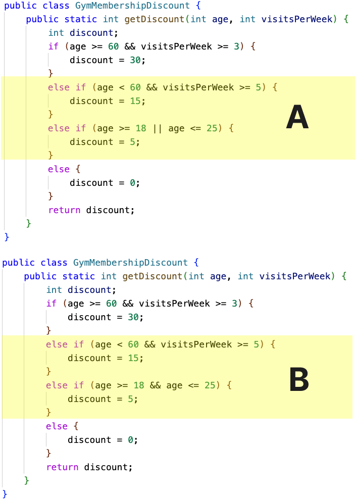
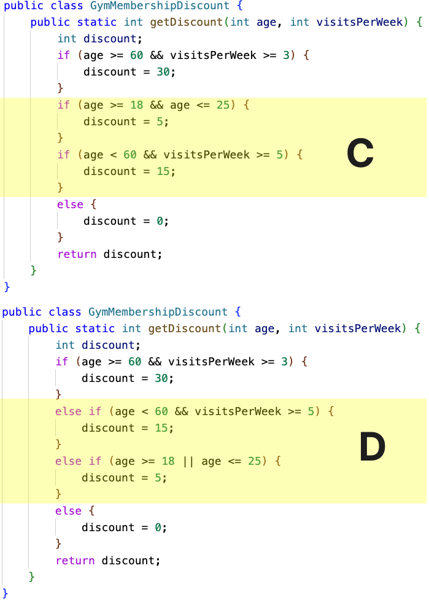
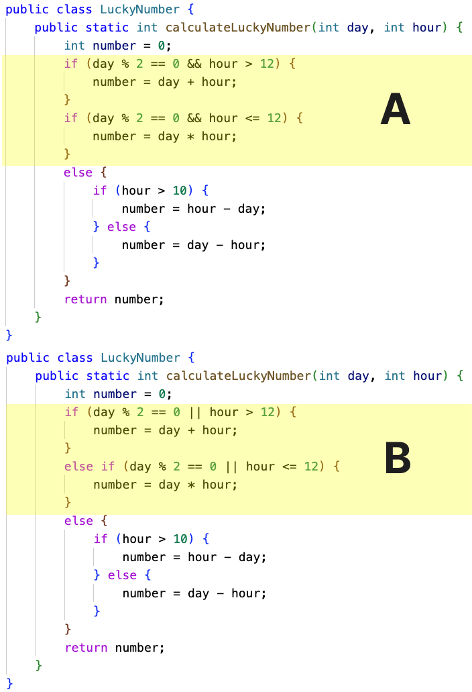
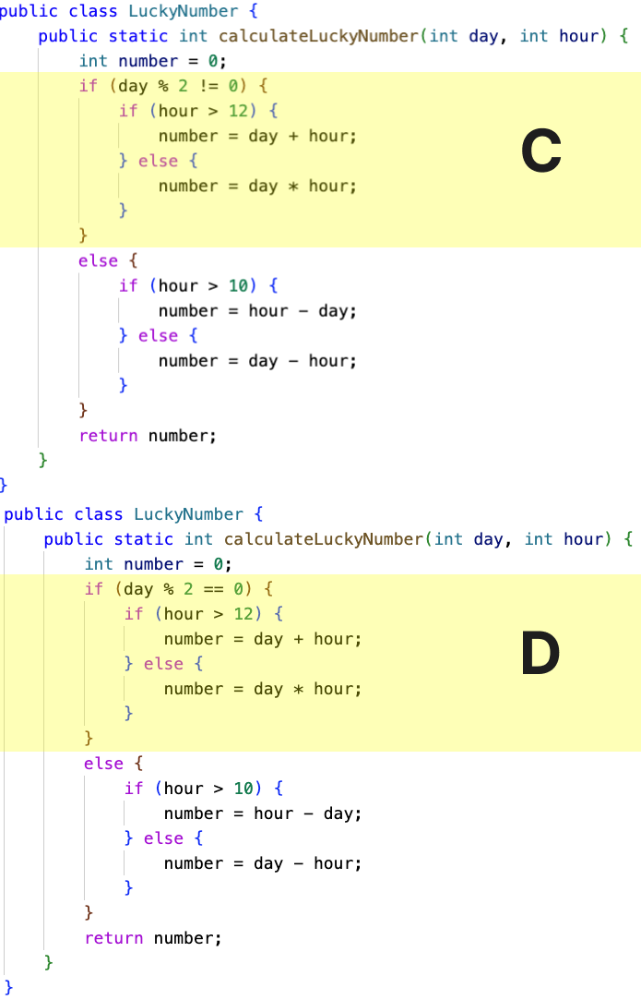
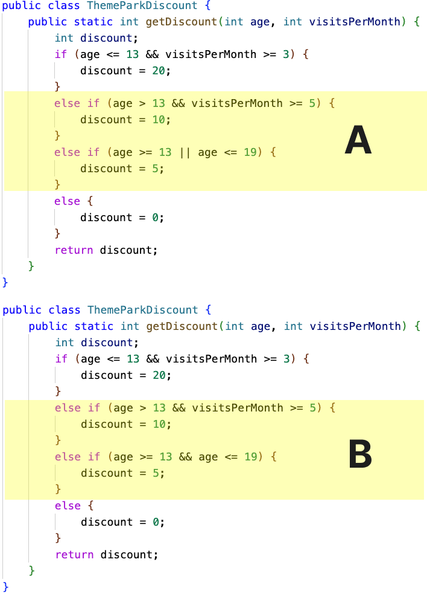
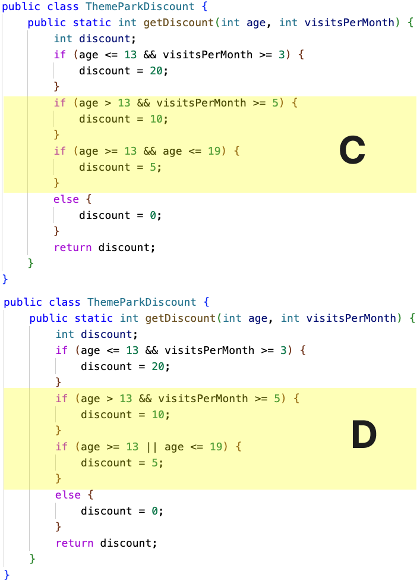
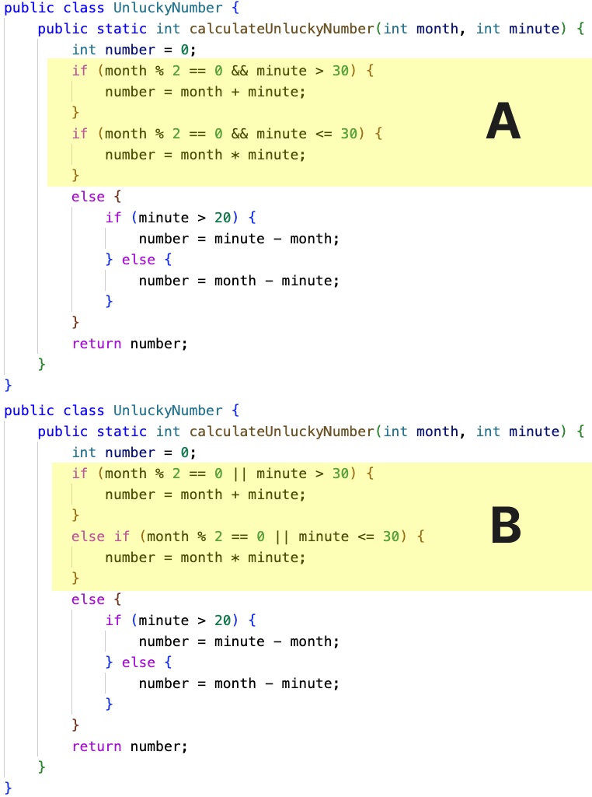
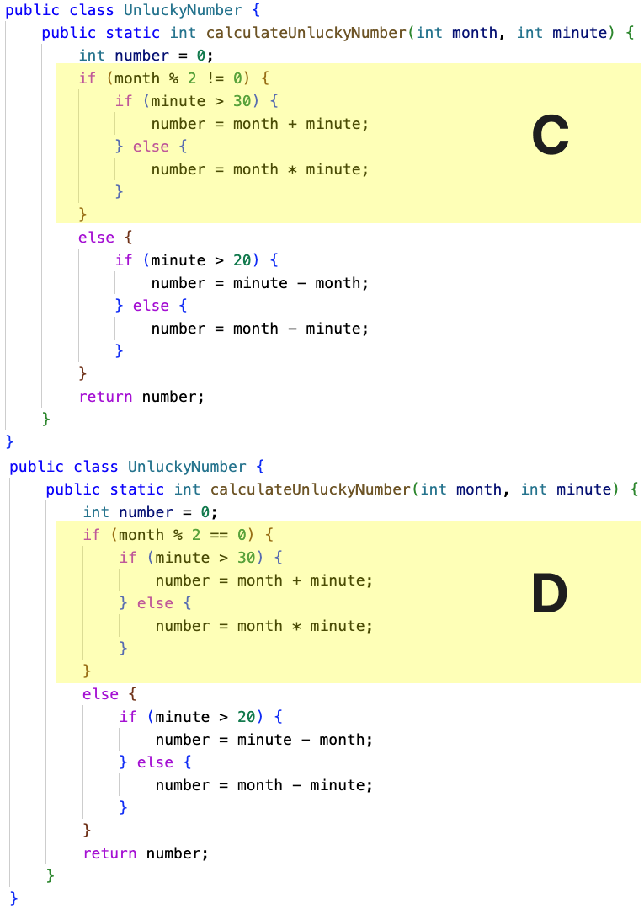

Practice Problems (Mixed Code)
==============================

.. parsonsprob:: most-common-practice-alarmclock-mixed
   :numbered: left
   :adaptive:
   :noindent:

   Given a ``day`` of the week encoded as 0=Sun, 1=Mon, 2=Tue, ...6=Sat, and a ``boolean`` indicating if we are on ``vacation``, return a string of the form ``"7:00"`` indicating when the alarm clock should ring. Weekdays, the alarm should be ``"7:00"`` and on the weekend it should be ``"10:00"``. Unless we are on vacation -- then on weekdays it should be ``"10:00"`` and weekends it should be ``"off"``.

   .. table::
      :name: alarmClock-table
      :class: longtable
      :align: left
      :width: 80%

      +----------------------------------------------------+-----------------+
      | Example Input                                      | Expected Output |
      +====================================================+=================+
      |      ``alarmClock(1, false)``                      | ``7:00``        |
      +----------------------------------------------------+-----------------+
      |      ``alarmClock(5, false)``                      | ``7:00``        |
      +----------------------------------------------------+-----------------+
      |      ``alarmClock(0, false)``                      | ``10:00``       |
      +----------------------------------------------------+-----------------+

   -----
   public class VacayAlarmClock {
      public static String alarmClock(int day, boolean vacation) {
   =====
         if (day >= 1 && day <= 5 && (vacation == false)){
   =====
            return "7:00";
   =====
         } else if ((day == 0 || day == 6 && (vacation == false)) || (day >= 1 && day <= 5 && (vacation == true))){
   =====
            return "10:00";
   =====
         } else {
   =====
            return "off";
   =====
         }
      }
    }

.. parsonsprob:: most-common-practice-datefashion-mixed
   :numbered: left
   :adaptive:
   :noindent:

   You and your date are trying to get a table at a restaurant. The parameter ``you`` is the stylishness of your clothes, in the range 0..10, and ``date`` is the stylishness of your date's clothes. The result getting the table is encoded as an int value with 0=no, 1=maybe, 2=yes. If either of you is very stylish, 8 or more, then the result is ``2`` (yes). With the exception that if either of you has style of 2 or less, then the result is ``0`` (no). Otherwise the result is ``1`` (maybe).

   .. table::
      :name: datFashion-table
      :class: longtable
      :align: left
      :width: 80%

      +----------------------------------------------------+-----------------+
      | Example Input                                      | Expected Output |
      +====================================================+=================+
      |      ``dateFashion(5, 10)``                        |     ``2``       |
      +----------------------------------------------------+-----------------+
      |      ``dateFashion(8, 2)``                         |     ``0``       |
      +----------------------------------------------------+-----------------+
      |      ``dateFashion(5, 5)``                         |     ``1``       |
      +----------------------------------------------------+-----------------+
   -----
   public class DateStylishness { 
   =====
      public static int dateFashion(int you, int date) {
   =====
         if (you <= 2 || date <= 2) {
   =====
            return 0; } 
   =====
         if (you >= 8 || date >= 8) { 
   =====
            return 2; } 
   =====
         return 1; } 
   =====
   } 

.. parsonsprob:: most-common-practice-frontback-mixed
   :numbered: left
   :grader: dag
   :noindent:

   Create the method ``front_back(str, start, end)`` that takes three strings and returns
   a string based on the following conditions.

   * If ``str`` contains ``start`` at the beginning and ``end`` at the end then return  ``"s_e"``.
   * If ``str`` contains ``start`` at the beginning of the string return ``"s"``.
   * if ``str`` contains ``end`` at the end of the string return ``"e"``.
   * Otherwise return ``"n"``.

   .. table::
      :name: front-back-table
      :class: longtable
      :align: left
      :width: 80%

      +----------------------------------------------------+-----------------+
      | Example Input                                      | Expected Output |
      +====================================================+=================+
      | ``front_back("Open at noon", "Open", "noon")``     | ``"s_e"``       |
      +----------------------------------------------------+-----------------+
      | ``front_back("Opening time", "Open", "noon")``     | ``"s"``         |
      +----------------------------------------------------+-----------------+
      | ``front_back("Afternoon", "Open", "noon")``        | ``"e"``         |
      +----------------------------------------------------+-----------------+
      | ``front_back("Closed", "Open", "noon")``           | ``"n"``         |
      +----------------------------------------------------+-----------------+
      | ``front_back("It is noon now", "open", "noon")``   | ``"n"``         |
      +----------------------------------------------------+-----------------+

   -----
   public class FrontBack { #tag:0; depends:;
   =====
       public static String front_back(String str, String start, String end) { #tag:1; depends:0;
   =====
          Boolean beginWithStart = str.indexOf(start) == 0;
          Boolean endWithEnd = str.indexOf(end) == (str.length() - end.length()); #tag:2; depends:1;
   =====
          if (beginWithStart && endWithEnd) { #tag:3; depends:2;
   =====
              return "s_e"; } #tag:4; depends:3;
   =====
          else if (beginWithStart && !endWithEnd) { 
              return "s";} #tag:5; depends:4;
   =====
          else if (!beginWithStart && endWithEnd) {
              return "e";} #tag:6; depends:4;
   =====
          else { #tag:7; depends:5,6;
   =====
              return "n"; #tag:8; depends:7;
   =====
          } #tag:9; depends:8;
   =====
       } #tag:10; depends:9;
   =====
   }  #tag:11; depends:10;

    

    

.. parsonsprob:: intro-sample-puzzle-csjava
    :numbered: left
    :adaptive:
    :practice: T

    Write a function that takes a number ``num`` and returns the number times 3. For example, ``triple(2)`` should return 6 and
    ``triple(-1)`` should return -3.  Look below the code to check for any compiler errors or the results from the test cases.  Be sure to ``return`` the result.
    -----
    public class Main {
    =====
        public static int tripleNum(int num) {
    =====
            return num * 3;
        } # end of tripleNum method
    =====
    } # end of class Main

.. activecode:: intro-sample-write-code-triple-csjava
    :practice: T
    :autograde: unittest
    :language:java

    Write a function that takes a number ``num`` and returns the number times 3. For example, ``triple(2)`` should return 6 and
    ``triple(-1)`` should return -3.  Look below the code to check for any compiler errors or the results from the test cases.  Be sure to ``return`` the result.
    ~~~~
    public class Main {

        // Function to triple a number
        public static int tripleNum(int num) {
            // ADD CODE HERE //

        }

        public static void main(String[] args)
        {
            System.out.println(tripleNum(3));
            System.out.println(tripleNum(-4));
            System.out.println(tripleNum(0));
        }
    }
    ====
    import static org.junit.Assert.*;
    import org.junit.Test;
    import java.io.IOException;
    import java.util.Arrays;

    public class RunestoneTests extends CodeTestHelper {
        public RunestoneTests() {
            super();
        }

        @Test
        public void testBoundarySum() throws IOException {
                String output = getMethodOutput("main");
                String expect = "9, -12, 0";
            boolean passed = getResults(expect, output, "Expected output from main");
            assertTrue(passed);

        }
    }