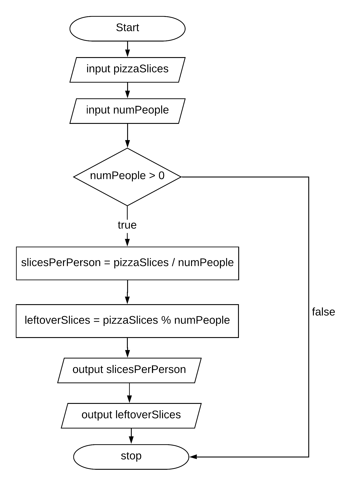

.. qnum::
   :prefix: 3-2-
   :start: 1
   
   
.. |CodingEx| image:: ../../_static/codingExercise.png
    :width: 30px
    :align: middle
    :alt: coding exercise
    
    
.. |Exercise| image:: ../../_static/exercise.png
    :width: 35
    :align: middle
    :alt: exercise
    
    
.. |Groupwork| image:: ../../_static/groupwork.png
    :width: 35
    :align: middle
    :alt: groupwork
    

if Statements and Control Flow
===============================

..	index::
	single: conditional
	single: if
	pair: conditional; if

The statements in a Java main method normally run or execute one at a time in the order they are found from top to 
bottom.   **If statements** (also called **conditionals** or **selection**) change the flow of control 
through the program so that some code is only run when something is true.  In an if statement, if the 
condition is true then the next statement or a block of statements will execute.  If the condition is 
false then the next statement or block of statements is skipped.

.. figure:: Figures/Condition.png
    :width: 200px
    :align: center
    :figclass: align-center

    Figure 1: The order that statements execute in a conditional

A conditional uses the keyword ``if`` followed by **Boolean expression** inside of  an 
open parenthesis ``(`` and a close parenthesis ``)`` and then followed by a single statement or block of statements.  
The single statement or block of statements are only executed if the condition is true.  
The open curly brace ``{`` and a close curly brace ``}`` are used to group a block of statements together.  
It is recommended to always put in the curly braces even if you have just one statement under the if statement. 

.. raw:: html

  <table >
  <tr >
  <th style="padding-right: 6em;">1 statement </th>
  <th style="padding-right: 6em;">1 statement </th>
  <th style="padding-right: 6em;">2+ statements </th>
  </tr>

  <tr style="margin-bottom:2em; border-bottom: 1px dashed black">
  <th >{} optional </th>
  <th >{} optional </th>
  <th >{} required </th>
  </tr>

  <tr>
  </tr>
  <tr >
  <td>if (x<10)</td>
  <td>if (x<10)</td>
  <td>if (x<10)</td>
  </tr>

  <tr>
  <td>&nbsp;&nbsp;&nbsp;count++;</td>
  <td>{</td>
  <td>{</td>
  </tr>

  <tr>
  <td> </td>
  <td>&nbsp;&nbsp;&nbsp;count++;</td>
  <td>&nbsp;&nbsp;&nbsp;count++;</td>
  </tr>

  <tr>
  <td> </td>
  <td>}</td>
  <td>&nbsp;&nbsp;&nbsp;System.out.println(count);</td>
  </tr>

  <tr>
  <td> </td>
  <td> </td>
  <td>}</td>
  </tr>

  </table>

.. note::

    Note that there is no semicolon (;) at the end of the boolean expression in an if statement even if it is the end of that line. The semicolon goes at the end of the whole if statement, often on the next line. Or { } are used to mark the beginning and end of the block of code under the if condition. 
    
Imagine that your cell phone wanted to remind you to take an umbrella if it was currently raining in your area when it detected that you were leaving the house.  This type of thing is going to become more common in the future and it is an area of research called Human Computer Interaction (HCI) or Ubiquitous Computing (computers are everywhere).  

.. activecode:: code3_2_1
   :language: java
   :autograde: unittest
  
   The variable ``isRaining`` is a boolean variable that is either true or false. If it is true then the message ``Take an umbrella!`` will be printed and then execution will continue with the next statement which will print ``Drive carefully``. Run the code below to see this.
   ~~~~
   public class TestRaining
   {
      public static void main(String[] args)
      {
        boolean isRaining = true;
        if (isRaining) 
        {
           System.out.println("Take an umbrella!"); 
        }
        System.out.println("Drive carefully");
      }
   }
   ====
   import static org.junit.Assert.*;
    import org.junit.*;;
    import java.io.*;

    public class RunestoneTests extends CodeTestHelper
    {
        @Test
        public void testMain() throws IOException
        {
            String output = getMethodOutput("main");
            String expect = "Take an umbrella! \nDrive carefully";
            boolean passed = getResults(expect, output, "Expected output from main");
            assertTrue(passed);
        }
    }

|Exercise| **Check your understanding**

.. fillintheblank:: q3_2_0

   Try changing the code above to ``boolean isRaining = false;``.  What will it print?

   -    :^Drive carefully$: Correct.  If the boolean is false, it will skip executing the print statement after the if.
        :.*: Try it and see
        
You can test for a false value using the ``!`` operator, which is read as "not".  We will see a better way to test for both
true and false in the next lesson.  However, the code below shows how to print different messages based on whether a value is true or false.

.. activecode:: code3_2_2
   :language: java
   :autograde: unittest
   :stdin: true
   
   This program reads in a boolean value from standard input and tests whether the value is true ``if (passedExam)`` or false ``if (!passedExam)``.  
   Use the CodeLens to step through the program.   Change the value in the standard input window to test the program with each possible boolean value.
   
   ~~~~
   import java.util.Scanner; 
   public class TestMidterm
   {
      public static void main(String[] args)
      {
        Scanner scan = new Scanner(System.in);
        
        System.out.println("Did you pass the midterm exam?");

        boolean passedExam = scan.nextBoolean();
        if (passedExam) 
        {
           System.out.println("Good job studying!"); 
        }
        if (!passedExam) 
        {
           System.out.println("Study harder next time."); 
        }
      }
   }
   ====
   import static org.junit.Assert.*;
    import org.junit.*;;
    import java.io.*;

    public class RunestoneTests extends CodeTestHelper
    {
        @Test
        public void testMain() throws IOException
        {
            boolean passed = getResults("true", "true", "main()");
            assertTrue(passed);
        }
    }
  
|Exercise| **Check your understanding**

.. mchoice:: q3_2_1
   :practice: T
   :answer_a: Because x < 2 is always true
   :answer_b: Because there is a semicolon ; at the end of the condition "if (x < 2) ;"
   :answer_c: Because Java makes a random decision
   :correct: b
   :feedback_a: Incorrect, 3 < 2 is always false so the print statement should never execute 
   :feedback_b: Correct.  Get rid of the ; at the end of the condition "if (x < 2) " 
   :feedback_c: Incorrect, 3 < 2 is always false so the print statement should never execute
   
   Consider the following code segment. Why does it always print "ERROR"?
   
   .. code-block:: java

     int x = 3;
     if (x < 2) ;
     {
         System.out.println("ERROR");
     }
     
  

Relational Operators in If Statements
---------------------------------------

Most if statements have a boolean condition that uses relational operators like ==, !=, <, >, <=, >=, as we saw in the last lesson. 

|CodingEx| **Coding Exercise**

.. activecode:: code3_2_3
   :language: java
   :autograde: unittest
   :practice: T
   
   Run the following active code a couple times until you see all the possible outputs. It prints out whether a random number is positive or equal to 0. Add another if statement that tests if it is a negative number.
   ~~~~
   public class TestNumbers
   {
      public static void main(String[] args)
      {
        // Get a random number from -10 up to 10.
        int number = (int) (Math.random()*21 - 10);
        System.out.println("The number is " + number);
        
        // is it positive?
        if (number > 0)
        {
           System.out.println(number + " is positive!");
        }
        // is it 0?
        if (number == 0)
        {
           System.out.println(number + " is zero!");
        }
      }
   }
   ====
   // Test Code for Lesson 3.2.1 - Activity 1 - if-relational
    import static org.junit.Assert.*;
    import org.junit.After;
    import org.junit.Before;
    import org.junit.Test;

    import java.io.*;

    public class RunestoneTests extends CodeTestHelper
    {
        @Test
        public void testPositive()
        {
            String output = "";
            int num = -999;

            while(num <= 0) {
                output = getMethodOutput("main");
                num = getNumber(output);
            }

            String expect = "The number is " + num + "\n" + num + " is positive!";

            boolean passed = getResults(expect, output, "Testing positive numbers");
            assertTrue(passed);
        }

        @Test
        public void testZero()
        {
            String output = "";
            int num = -999;

            while(num != 0) {
                output = getMethodOutput("main");
                num = getNumber(output);
            }

            String expect = "The number is " + num + "\n" + num + " is zero!";

            boolean passed = getResults(expect, output, "Testing zero");
            assertTrue(passed);
        }

        @Test
        public void testNegative()
        {
            String output = "";
            int num = 999;

            while(num >= 0) {
                output = getMethodOutput("main");
                num = getNumber(output);
            }

            String expect = "The number is " + num + "\n" + num + " is negative!";

            boolean passed = getResults(expect, output,"Testing negative numbers");
            assertTrue(passed);
        }

        private int getNumber(String output) {
            output = output.replaceAll("The number is ", "");
            int space = output.indexOf("\n");

            String numStr = output;

            if (space >= 0)
                numStr = numStr.substring(0, space).trim();

            return Integer.parseInt(numStr);
        }
    }

.. note::

    A common mistake in if statements is using = instead of == in the condition by mistake. You should always **use ==**, not =, in the condition of an if statement to test a variable. One equal sign (=) assigns a value to a variable, and two equal signs (==) test if a variable has a certain value.
    
|Exercise| **Check your understanding**

.. mchoice:: q3_2_2
   :practice: T
   :answer_a: 3
   :answer_b: 6
   :answer_c: 0
   :answer_d: 4
   :answer_e: The code will not compile
   :correct: c
   :feedback_a: x is changed by the if statements.
   :feedback_b: What happens when x is greater than 2 and then greater than 4? Do both if statements.  
   :feedback_c: If x is greater than 2, it's always doubled, and then that result is always greater than 4, so it's set to 0 in the second if statement.  
   :feedback_d: x is changed by the if statements.
   :feedback_e: This code will compile.

   Consider the following code segment. What is printed as a result of executing the code segment?
   
   .. code-block:: java

     int x = 3;
     if (x > 2) 
     {
         x = x * 2;
     }
     if (x > 4) 
     {
        x = 0;
     }
     System.out.print(x);
     

.. More practice with if == and < > Active code.
    Note always use == not = in an if statement! Test not assign.

        
Conditional Control Flow
-------------------------------------

Recall the program to compute the number of pizza slices per person from Unit 1.  

.. activecode:: code3_2_4
   :language: java 
   :stdin: 16 0  

   
   Run the program to confirm that it fails when a value of 0 is entered for numPeople (second input value). 
   ~~~~
    import java.util.Scanner;
    public class PizzaCalculatorInput {

        public static void main(String[] args) {
            int pizzaSlices, numPeople, slicesPerPerson, leftoverSlices;
            Scanner scan = new Scanner(System.in);
            pizzaSlices = scan.nextInt();
            numPeople = scan.nextInt();
            slicesPerPerson = pizzaSlices / numPeople;
            leftoverSlices = pizzaSlices % numPeople;
            System.out.println(slicesPerPerson);
            System.out.println(leftoverSlices);
        }

    }

To avoid division by 0, the calculation for ``slicesPerPerson`` and ``leftoverSlices`` should be skipped when the number of people is 0.  
In fact, the calculation is nonsense if the number of people is a negative number so the program should check if a positive value is read from input.   
The program should actually ensure positive values are input for both the number of people and number of pizza slices, but for now you will only test the number of people.
You will see how to test compound boolean expressions in a later lesson. 

    Figure 2: Conditional Control Flow

The flowchart in Figure 2 demonstrates the desired control flow based on an ``if`` statement, represented with a diamond symbol.
If the condition ``numPeople > 0`` is true, the process follows the path labelled **true**, which contains the 4 steps to calculate and 
print ``slicesPerPerson`` and ``leftoverSlices``.  
The 4 statements along the ``true`` branch must be nested within curly braces in a Java program otherwise only the first step would be considered part of the true branch.   
If the condition ``numPeople > 0`` is false, the **false** branch is followed and the 4 statements for calculating and printing are skipped.

.. activecode:: code3_2_5
   :language: java 
   :stdin: 16 0  
   :autograde: unittest
   
   Update the program based on the conditional control flow shown in Figure 2.  Add an if statement to test the value stored in numPeople.
   Don't forget curly braces around the 4 lines for computing and printing slicesPerPerson and leftoverSlices.

   Run the program multiple times with negative, 0, and positive values for number of people.  The program should no longer result in a divide by zero exception.  
   ~~~~
    import java.util.Scanner;
    public class PizzaCalculatorInput {

        public static void main(String[] args) {
            int pizzaSlices, numPeople, slicesPerPerson, leftoverSlices;
            Scanner scan = new Scanner(System.in);
            pizzaSlices = scan.nextInt();
            numPeople = scan.nextInt();
            
            slicesPerPerson = pizzaSlices / numPeople;
            leftoverSlices = pizzaSlices % numPeople;
            System.out.println(slicesPerPerson);
            System.out.println(leftoverSlices);

        }

    }
   ====
    import static org.junit.Assert.*;
    import org.junit.After;
    import org.junit.Before;
    import org.junit.Test;

    import java.io.*;

    public class RunestoneTests extends CodeTestHelper
    {

    @Test
    public void test1a()
    {
      String code = getCode();
      int count= countOccurences(code, "if (numPeople > 0)");
      boolean passed = (count== 1);
      
      passed = getResults("1 numPeople > 0", count+ " numPeople > 0", "Missing test: if (numPeople > 0)", passed);
    }
    }

Common Errors with If Statements
---------------------------------

Here are some rules to follow with if statements to avoid some common errors:

- Always use curly brackets ``{`` and ``}`` to enclose the block of statements under the if condition. Java doesn't care if you indent the code -- it goes by the { }. 

- Don't put in a semicolon ``;`` after the first line of the if statement, if (test);. The if statement is a multiline block of code that starts with the if condition and then { the body of the if statement }. 

- Always use **==**, not =, in the condition of an if statement to test a variable. One = assigns, two == tests!

|CodingEx| **Coding Exercise**

   
.. activecode:: code3_2_6
   :language: java
   :autograde: unittest
   :stdin: true

   The code below doesn't work as expected. It has 2 errors. 
   Run the program with input true, then change the input to false and run again.
   Even when the input is false, the program still prints both messages.
   Fix it to only print both "Wear a coat" and "Wear gloves" when isCold is true.
   Nothing should print when isCold is false.
   
   ~~~~
   import java.util.Scanner; 
   public class TestCold
   {
      public static void main(String[] args)
      {
        Scanner scan = new Scanner(System.in);
      
        System.out.println("Is it cold?");
        boolean isCold = scan.nextBoolean();

        if (isCold); 
            System.out.println("Wear a coat");
            System.out.println("Wear gloves");
        
      }
   }
   ====
    import static org.junit.Assert.*;
    import org.junit.*;;
    import java.io.*;

    public class RunestoneTests extends CodeTestHelper
    {
       
        @Test
        public void testsemicolon()
        {
            String code = getCode();
            int num = countOccurences(code, "isCold);");
            boolean passed1 = num == 0;

            getResults("0", "" + num, "if (isCold);  get rid of semicolon", passed1);
        
            int num2 = countOccurences(code, "{");
            boolean passed2 = num2 >= 3;

            getResults("3", "" + num2, "Number of {", passed2);
            assertTrue(passed1 && passed2);
        }
    }

|Groupwork| Programming Challenge : Magic 8 Ball
------------------------------------------------

.. image:: Figures/Magic_eight_ball.png
    :width: 100
    :align: left
    :alt: Magic 8 Ball
 
 
.. |video| raw:: html

   <a href="https://www.youtube.com/watch?v=WSaS17CSS4c" target="_blank">video</a>

.. |lesson 2.9| raw:: html

   <a href="https://runestone.academy/runestone/books/published/csawesome/Unit2-Using-Objects/topic-2-9-Math.html" target="_blank">lesson 2.9</a>

Have you ever seen a Magic 8 ball? You ask it a yes-no question and then shake it to get a random response like "Signs point to yes!", "Very doubtful", etc. If you've never seen a Magic 8 ball, check out this |video|.

Come up with 8 responses to yes-no questions. 
Write a program below that chooses a random number from 1 to 8 and then uses if 
statements to test the number and print out the associated random response from 1-8. 

If you need help with random numbers, see lesson 2.9.

For an extra challenge, have the program create a Scanner and read the question from standard 
input before generating a response.   Repeat the user's question as part of the response.
 

.. activecode:: code3_2_7
   :language: java
   :autograde: unittest
   :stdin: Should I order a pizza for dinner?
   
   import java.util.Scanner; 
   public class Magic8Ball
   {
      public static void main(String[] args)
      {
        // Get a random number from 1 to 8
        
        // Use if statements to test the random number 
        // and print out 1 of 8 random responses 
        
          
      }
   }
   ====
   import static org.junit.Assert.*;
    import org.junit.*;
    import java.io.*;
    import java.util.ArrayList;

    public class RunestoneTests extends CodeTestHelper
    {
        public RunestoneTests() {
            super("Magic8Ball");
        }

        @Test
        public void test1()
        {
            String output = getMethodOutput("main");

            boolean passed = output.length() > 0;

            passed = getResults("Output length > 0", "Output length of " + output.length(), "Prints a statement", passed);
            assertTrue(passed);
        }

        @Test
        public void test2()
        {
            String[] output = new String[200];

            for (int i = 0; i < output.length; i++) {
                output[i] = getMethodOutput("main");
            }

            ArrayList <String> lines = new ArrayList <String> ();

            for (int i = 0; i < output.length; i++) {
                if (!lines.contains(output[i]))
                    lines.add(output[i]);
            }

            int responses = lines.size();
            boolean passed = lines.size() >= 8;

            passed = getResults("8", ""+responses, "Unique responses", passed);
            assertTrue(passed);
        }

        @Test
        public void test3()
        {
            String code = getCodeWithoutComments();

            int numIfs = countOccurences(code, "if");

            boolean passed = numIfs >= 7;

            passed = getResults("7 or more", ""+numIfs, "Code has at least 7 if statements", passed);
            assertTrue(passed);
        }
    }

.. |repl version| raw:: html

    <a href="https://repl.it/@BerylHoffman/Magic8BallTemplate" target="_blank" style="text-decoration:underline">repl version</a>

.. Here's a |repl version| that uses the Scanner class to first have the user ask a question. You can add your code in from above and try running it. 

.. .. raw:: html

    <iframe height="650px" width="100%" style="max-width:90%; margin-left:5%" src="https://repl.it/@BerylHoffman/Magic8BallTemplate?lite=true" scrolling="no" frameborder="no" allowtransparency="true" allowfullscreen="true" sandbox="allow-forms allow-pointer-lock allow-popups allow-same-origin allow-scripts allow-modals"></iframe>
    
Summary
-------------------  

- if statements test a boolean expression and if it is true, go on to execute the following statement or block of statements surrounded by curly brackets { } like below.

.. code-block:: java

    // A single if statement
    if (boolean expression)
        Do statement;
    // A block if statement    
    if (boolean expression)
    {
       Do Statement1;
       Do Statement2;
       ...
       Do StatementN;
    }

- Java boolean expressions can compare primitive values and reference values with the relational operators == and != and arithmetic expression values with the relational operators (i.e., <, >, <=, >=).

- Conditional (if) statements affect the flow of control by executing different statements based on the value of a Boolean expression.

